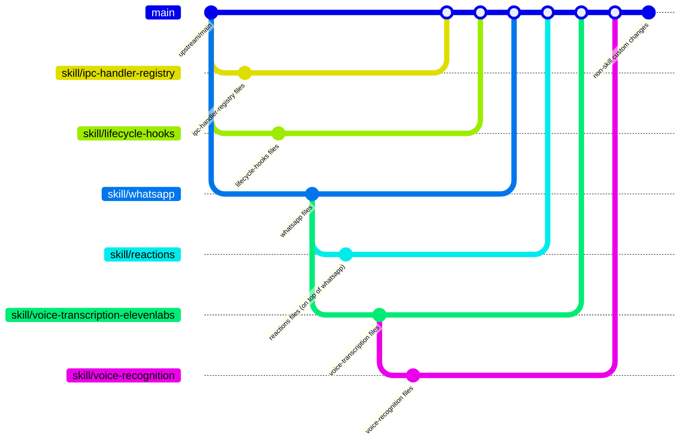
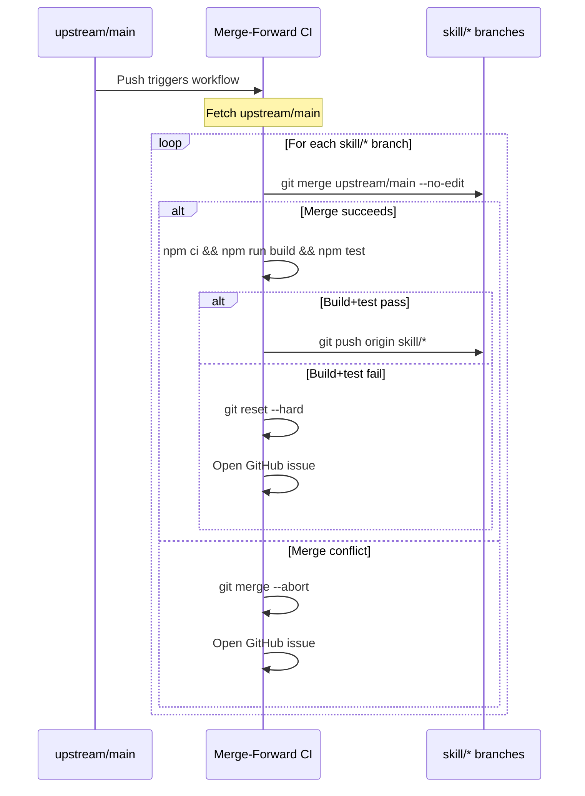
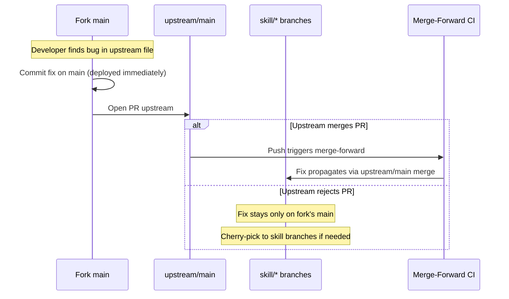
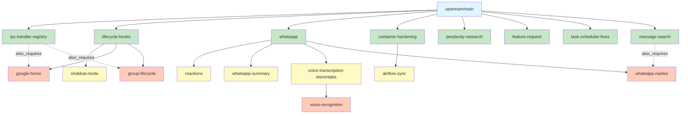

# Design Document: Clean Fork Alignment

## Overview

This design covers the restructuring of a NanoClaw fork so that `main` equals `upstream/main` + merged skill branches + non-skill custom changes. The migration extracts 17 skills from a monolithic `main` (202 commits ahead of upstream) into clean `skill/*` branches with proper dependency hierarchy, merges them back in tier order, and cuts over to the new `main`.

This is a git repository restructuring effort, not a code feature. The "architecture" is a sequence of git operations, the "components" are branches and CI workflows, and the "data model" is the skill dependency graph encoded in `skill-metadata.json` files and git ancestry.

### Key Design Decisions

1. **Fresh_Main from upstream/main** — Start clean rather than trying to rewrite history on the existing `main`. This guarantees proper merge-base ancestry for future `git merge upstream/main`.

2. **Extraction worktree** — All work happens in `../gabay-extraction` so the live service in `~/code/yonibot/gabay` is never touched until cutover.

3. **Skill branches based on parent skills (not main)** — Per the upstream spec, `skill/reactions` branches from `skill/whatsapp`, not from `main`. Merging a dependent skill automatically includes its parent.

4. **Merge-forward CI merges `upstream/main` (not `origin/main`)** — This keeps skill branches clean: upstream core + only that skill's changes. If CI merged `origin/main`, skill branches would get cross-contaminated with other skills' code.

5. **Core fixes stay on `main`** — Bug fixes to upstream files are committed on `main` for immediate deployment, PR'd upstream, and only reach skill branches when upstream merges the PR and merge-forward picks it up. This keeps skill branches contribution-ready.

6. **`skill-metadata.json` for dependency tracking** — Each branch carries metadata documenting its name, tier, dependencies, and `also_requires` for multi-parent skills. Upstream uses implicit git ancestry; our metadata is additive and non-harmful.

## Architecture

The migration is a linear pipeline of git operations organized into 5 phases:

```mermaid
flowchart TD
    A[Phase 1: Safety & Preparation] --> B[Phase 2: Tier 0 Extraction]
    B --> C[Phase 3: Tier 1+ Extraction]
    C --> D[Phase 4: Assembly & Cutover]
    D --> E[Phase 5: Verification & CI]

    subgraph "Phase 1"
        A1[Backup tag on main] --> A2[Disable merge-forward CI]
        A2 --> A3[Create extraction worktree]
        A3 --> A4[Create fresh-main from upstream/main]
        A4 --> A5[Verify upstream baseline builds]
    end

    subgraph "Phase 2"
        B1[Branch skill/X from fresh-main] --> B2[Cherry-pick/apply skill files]
        B2 --> B3[Add skill-metadata.json]
        B3 --> B4[Build + test on branch]
        B4 --> B5[Commit with explicit staging]
        B5 -.->|repeat for each Tier 0 skill| B1
    end

    subgraph "Phase 3"
        C1[Branch skill/X from parent skill] --> C2[Apply skill-specific changes only]
        C2 --> C3[Add skill-metadata.json]
        C3 --> C4[Build + test on branch]
        C4 --> C5[Commit with explicit staging]
        C5 -.->|repeat for each Tier 1/2 skill| C1
    end

    subgraph "Phase 4"
        D1[Merge Tier 0 into fresh-main] --> D2[Build + test]
        D2 --> D3[Merge Tier 1 into fresh-main]
        D3 --> D4[Build + test]
        D4 --> D5[Merge Tier 2 into fresh-main]
        D5 --> D6[Build + test]
        D6 --> D7[Apply non-skill custom changes]
        D7 --> D8[Verify vs current main]
        D8 --> D9[Stop service → force-push → rebuild → restart]
    end

    subgraph "Phase 5"
        E1[Smoke test live service] --> E2[Re-enable merge-forward CI]
        E2 --> E3[Verify CI merges upstream/main into all skill branches]
        E3 --> E4[Remove extraction worktree]
    end
```



### Branch Topology (Target State)



### Merge-Forward CI Flow (Post-Cutover)



**Critical CI change:** The current workflow merges `origin/main` (the fork's main) into skill branches. Post-migration, it must merge `upstream/main` instead. This prevents skill branches from being polluted with other skills' code that lives on the fork's `main`.

**Scope of merge-forward:** Merge-forward propagates upstream core changes only. Updates to a parent skill branch (e.g., a new commit on `skill/whatsapp`) do not automatically flow into dependent branches (e.g., `skill/reactions`). This matches upstream's model — dependent branches inherit their parent's state at branch creation time, and users re-merge the parent to pick up updates.

### Core Fix Propagation Flow



## Components and Interfaces

Since this is a git restructuring (not a code feature), "components" are the operational elements of the migration and ongoing maintenance.

### Component 1: Extraction Pipeline

**Purpose:** Extract each skill from the monolithic `main` into a clean branch.

**Interface:**
- Input: Current `main` (202 commits ahead of upstream), skill inventory table
- Output: 17 `skill/*` branches, each containing upstream/main + only that skill's changes
- Tool: `git show main:<path>` for new files, `git diff upstream/main..main -- <path>` for modified files

**Extraction per skill:**
```bash
# For new files:
git show main:<file_path> > <file_path>

# For modified files:
# 1. Start from upstream version (already on branch via fresh-main ancestry)
# 2. Apply only the diff hunks belonging to this skill
git diff upstream/main..main -- <file_path>  # review hunks
# Manually apply relevant hunks, or cherry-pick specific commits
```

**Shared file conflict strategy:** Files modified by multiple skills (e.g., `src/index.ts`, `src/db.ts`, `src/ipc.ts`) require careful hunk-level extraction. Each skill branch gets only its hunks. When merged back into `fresh-main`, git's three-way merge handles recombination since each branch diverged from the same base.

### Component 2: Skill Metadata Schema

**Purpose:** Machine-readable dependency tracking on each skill branch.

**File:** `skill-metadata.json` (root of each skill branch)

### Component 3: Merge-Forward CI (Modified)

**Purpose:** Keep skill branches current with upstream core changes.

**Key modification:** Change merge source from `origin/main` to `upstream/main`.

**Current behavior:** Merges the fork's `main` into skill branches → cross-contaminates skills with each other's code.

**New behavior:** Merges `upstream/main` into skill branches → skill branches stay clean (upstream core + only that skill).

**Implementation change in `.github/workflows/merge-forward-skills.yml`:**
```yaml
# Add upstream remote
- name: Add upstream remote
  run: |
    git remote add upstream https://github.com/qwibitai/nanoclaw.git
    git fetch upstream main

# Change merge source in the merge step
# OLD: git merge main --no-edit
# NEW: git merge upstream/main --no-edit
```

### Component 4: Cutover Procedure

**Purpose:** Atomically swap the live service from old `main` to new `main`.

**Sequence:**
1. `systemctl --user stop nanoclaw` — stop live service
2. Push all `skill/*` branches with `--force-with-lease`
3. Push `fresh-main` as `main` with `--force-with-lease`
4. In live directory: `git fetch origin && git reset --hard origin/main`
5. `npm ci && npm run build && ./container/build.sh`
6. `systemctl --user start nanoclaw`
7. Smoke test

**Estimated downtime:** ~2 minutes (stop → push → fetch → rebuild → start)

### Component 5: Rollback Procedure

**Purpose:** Restore pre-migration state if anything goes wrong.

**Sequence:**
```bash
git checkout main
git reset --hard backup/pre-fork-alignment-<timestamp>
git push --force origin main
gh workflow enable merge-forward-skills.yml
npm ci && npm run build
systemctl --user restart nanoclaw
```

## Data Models

### Skill Metadata Schema (`skill-metadata.json`)

```json
{
  "name": "string — skill name matching the branch suffix (e.g., 'reactions')",
  "description": "string — human-readable description",
  "tier": "integer — 0, 1, or 2",
  "dependencies": ["string[] — direct git branching parent(s), empty for Tier 0"],
  "also_requires": ["string[] — optional, non-primary dependencies for multi-parent skills"]
}
```

**Examples:**

Tier 0 (no dependencies):
```json
{
  "name": "ipc-handler-registry",
  "description": "Modular IPC handler registration system",
  "tier": 0,
  "dependencies": []
}
```

Tier 1 (single parent):
```json
{
  "name": "reactions",
  "description": "Emoji status reactions for message lifecycle",
  "tier": 1,
  "dependencies": ["whatsapp"]
}
```

Tier 2 (multi-parent):
```json
{
  "name": "google-home",
  "description": "Google Home voice assistant integration",
  "tier": 2,
  "dependencies": ["lifecycle-hooks"],
  "also_requires": ["ipc-handler-registry"]
}
```

### Skill Dependency Graph



Legend: Blue = upstream/main, Green = Tier 0, Yellow = Tier 1, Orange = Tier 2. Solid arrows = git branching parent (`dependencies`). Dashed arrows = `also_requires`.

### Merge Order (Dependency-Ordered)

| Order | Branch | Parent | Tier |
|-------|--------|--------|------|
| 1 | skill/ipc-handler-registry | fresh-main | 0 |
| 2 | skill/lifecycle-hooks | fresh-main | 0 |
| 3 | skill/whatsapp | fresh-main | 0 |
| 4 | skill/container-hardening | fresh-main | 0 |
| 5 | skill/perplexity-research | fresh-main | 0 |
| 6 | skill/feature-request | fresh-main | 0 |
| 7 | skill/task-scheduler-fixes | fresh-main | 0 |
| 8 | skill/message-search | fresh-main | 0 |
| 9 | skill/reactions | skill/whatsapp | 1 |
| 10 | skill/shabbat-mode | skill/lifecycle-hooks | 1 |
| 11 | skill/akiflow-sync | skill/container-hardening | 1 |
| 12 | skill/whatsapp-summary | skill/whatsapp | 1 |
| 13 | skill/voice-transcription-elevenlabs | skill/whatsapp | 1 |
| 14 | skill/google-home | skill/lifecycle-hooks | 2 |
| 15 | skill/group-lifecycle | skill/lifecycle-hooks | 2 |
| 16 | skill/whatsapp-replies | skill/whatsapp | 2 |
| 17 | skill/voice-recognition | skill/voice-transcription-elevenlabs | 2 |

Within each tier, order doesn't matter. Between tiers, all lower-tier merges must complete before higher-tier merges begin.


## Correctness Properties

*A property is a characteristic or behavior that should hold true across all valid executions of a system — essentially, a formal statement about what the system should do. Properties serve as the bridge between human-readable specifications and machine-verifiable correctness guarantees.*

Since this is a git restructuring (not a code feature), the properties below are verifiable via git commands (`git merge-base --is-ancestor`, `git diff`, `git log`, `git show`) and JSON schema validation against `skill-metadata.json`. They can be implemented as a post-migration validation script.

### Property 1: Skill Branch Ancestry Chain

*For any* skill branch, the following ancestry invariants must hold:
- `upstream/main` is a git ancestor of the skill branch (verifiable via `git merge-base --is-ancestor upstream/main skill/<name>`)
- For Tier 1/2 skills, the declared primary parent skill branch is a git ancestor (verifiable via `git merge-base --is-ancestor skill/<parent> skill/<name>`)
- For Tier 0 skills, `fresh-main` (which equals `upstream/main`) is the direct branching point

**Validates: Requirements 6.1, 7.1, 8.1, 14.1, 14.2, 14.3**

### Property 2: Skill File Isolation

*For any* skill branch, the diff between that branch and its parent branch (`git diff <parent>..skill/<name> --name-only`) must contain only files belonging to that skill (as defined in the skill inventory), plus `skill-metadata.json`. No files belonging to a different skill or unrelated to the skill should appear in the diff.

**Validates: Requirements 6.2, 7.2, 8.2, 14.4**

### Property 3: Skill Metadata Schema and Consistency

*For any* skill branch, the `skill-metadata.json` file must:
- Exist at the repository root
- Contain required fields: `name` (string matching the branch suffix), `description` (string), `tier` (integer 0, 1, or 2), `dependencies` (array of strings)
- Have `dependencies: []` for Tier 0 skills
- Have `dependencies` listing exactly the git branching parent for Tier 1/2 skills
- Include `also_requires` (non-empty array) when the skill has non-primary dependencies (multi-parent Tier 2 skills)
- Have `tier` value matching the skill's actual tier in the dependency graph

**Validates: Requirements 6.3, 7.3, 8.3, 15.1, 15.2, 15.3, 15.4**

### Property 4: Independent Buildability

*For any* skill branch, checking out that branch and running `npm ci && npm run build && npx vitest run` must succeed. Each skill branch is self-contained: upstream core + parent skill(s) + this skill's changes, and must build and pass tests without any other skill's code present.

**Validates: Requirements 6.4, 7.4, 8.4**

### Property 5: Tier-Ordered Merge Sequence

*For any* two merge commits on `fresh-main` where one merges a Tier N skill and the other merges a Tier M skill (N < M), the Tier N merge commit must appear before the Tier M merge commit in the git history (i.e., the Tier N merge is an ancestor of the Tier M merge).

**Validates: Requirements 9.1, 9.2**

### Property 6: Complete Skill Integration

*For any* of the 17 skill branches, after all merges into `fresh-main` are complete, that skill branch must be a git ancestor of `fresh-main` (verifiable via `git merge-base --is-ancestor skill/<name> fresh-main`).

**Validates: Requirements 9.1, 9.2, 9.3, 9.4, 9.5**

### Property 7: No Source File Loss

*For any* source file present on the current `main` under `src/`, that file must also exist on `fresh-main` after all merges and custom changes are applied — unless the absence is explicitly documented as intentional.

**Validates: Requirements 11.2**

### Property 8: Stale Branch Elimination

*For any* `skill/*` branch on `origin` after cutover, that branch must share merge history with the new `main` (i.e., `git merge-base main origin/skill/<name>` returns a valid commit that is an ancestor of both). No pre-migration stale skill branches should remain.

**Validates: Requirements 12.2**

### Property 9: Merge-Forward CI Source Correctness

*For any* execution of the merge-forward CI workflow, the merge source must be `upstream/main` (not `origin/main`). This ensures skill branches remain clean: upstream core + only that skill's changes, without cross-contamination from other skills on the fork's `main`.

**Validates: Requirements 13.2, 18.3**

### Property 10: Upstream Merge Compatibility

*For any* state of `fresh-main` (the new `main`), `git merge-base main upstream/main` must return a valid commit, and `upstream/main` must be a git ancestor of `main`. This ensures future `git merge upstream/main` operations use proper three-way merge with correct common ancestors.

**Validates: Requirements 16.1, 16.2**

## Error Handling

### Merge Conflicts During Extraction

**Scenario:** Cherry-picking or applying changes from current `main` to a skill branch produces conflicts.

**Handling:** Resolve manually. The extraction is a one-time operation. Common conflict sources:
- Multiple skills modify the same file (e.g., `src/index.ts`, `src/db.ts`) — extract only the hunks for the current skill
- Upstream has diverged from the version the skill was originally written against — adapt the skill code to the current upstream API

### Merge Conflicts During Assembly

**Scenario:** Merging skill branches into `fresh-main` produces conflicts (especially for shared files like `src/index.ts`).

**Handling:** Resolve conflicts preserving both skills' changes. This is expected when multiple skills add imports, register handlers, or modify the same integration points. After resolution, run build + tests to verify.

### Build/Test Failure on Skill Branch

**Scenario:** A skill branch fails to build or pass tests independently.

**Handling:**
1. Check if the failure is due to missing dependencies from another skill (indicates wrong tier classification or missing `also_requires`)
2. Check if upstream API changes broke the skill code (adapt the skill)
3. If the skill genuinely can't build independently, document it and proceed — the skill will work when merged with its dependencies on `main`

### Cutover Failure

**Scenario:** The service fails to start after cutover.

**Handling:** Execute rollback procedure:
```bash
git reset --hard backup/pre-fork-alignment-<timestamp>
git push --force origin main
npm ci && npm run build
systemctl --user restart nanoclaw
```

### Merge-Forward CI Failure Post-Cutover

**Scenario:** The re-enabled merge-forward CI fails for one or more skill branches.

**Handling:** The CI automatically opens a GitHub issue. Manual resolution:
1. Check out the failing skill branch
2. Merge `upstream/main` manually
3. Resolve conflicts
4. Build + test
5. Push

### Core Fix Not Yet Upstream

**Scenario:** A core fix on `main` hasn't been merged upstream yet, and a skill branch fails because it's missing the fix.

**Handling:** Per Requirement 18:
- If non-urgent: wait for upstream to merge the PR; merge-forward will propagate it
- If urgent: cherry-pick the fix onto the specific skill branch as a temporary measure
- If upstream rejects the PR: the cherry-pick becomes permanent

## Testing Strategy

### Validation Script (Post-Migration)

Since this is a git restructuring, the primary testing mechanism is a validation script that checks all correctness properties against the actual git state. This script should be run:
1. After all skill branches are created (Properties 1-4)
2. After all merges into `fresh-main` (Properties 5-7)
3. After cutover (Properties 8-10)

### Exhaustive Validation Tests

The input space is 17 skills — small enough for exhaustive iteration. Rather than using `fast-check` to randomly sample from a known finite set, the validation tests iterate over all skills deterministically with a `for (const skill of allSkills)` loop. This gives the same coverage with clearer failure messages (the failing skill name is directly in the test output, no shrinking needed).

Each test should be tagged with: **Feature: clean-fork-alignment, Property {number}: {property_text}**

**Implementation approach:** A validation test file (`tests/fork-alignment-validation.test.ts`) that:
1. Defines the skill inventory (the 17 skills with their tiers, parents, expected files)
2. For each skill, runs git commands to verify ancestry, file isolation, metadata, etc.
3. Uses `describe.each` or explicit loops — not `fast-check` — since the input space is fully enumerable

**Property tests (from Correctness Properties):**

| Property | Test Approach | Method |
|----------|--------------|--------|
| 1: Ancestry Chain | For each skill, run `git merge-base --is-ancestor` for upstream/main and parent | Exhaustive loop over all 17 skills |
| 2: File Isolation | For each skill, diff against parent, verify files match expected set | Exhaustive loop over all 17 skills |
| 3: Metadata Schema | For each skill, parse `skill-metadata.json`, validate against schema | Exhaustive loop over all 17 skills |
| 4: Independent Buildability | For each skill, checkout and run build+test | Sequential (expensive, run once per skill) |
| 5: Tier-Ordered Merges | For all pairs of merge commits with different tiers, verify ordering | Exhaustive loop over all cross-tier pairs |
| 6: Complete Integration | For each skill, verify `git merge-base --is-ancestor` against fresh-main | Exhaustive loop over all 17 skills |
| 7: No Source File Loss | For each source file on main, verify existence on fresh-main | Exhaustive loop over file list |
| 8: Stale Branch Elimination | For each skill/* on origin, verify shared merge history with main | Exhaustive loop over remote branches |
| 9: CI Source Correctness | Parse workflow YAML, verify merge source is upstream/main | Single assertion |
| 10: Upstream Merge Compatibility | Verify merge-base between main and upstream/main | Single assertion |

### Unit Tests (Specific Examples and Edge Cases)

- Backup tag exists and matches naming pattern (Req 1.1)
- All 8 Tier 0 skill branches exist (Req 6.6)
- All 5 Tier 1 skill branches exist with correct parents (Req 7.5)
- All 4 Tier 2 skill branches exist with correct parents and also_requires (Req 8.5)
- `skill/message-search` has no WhatsApp-specific naming (Req 6.7)
- Non-skill custom files (CLAUDE.md, .github/workflows/, etc.) exist on fresh-main (Req 10.2)
- Container builds successfully (Req 11.4)
- Smoke test checklist items pass (Req 12.6)
- Merge-forward CI workflow YAML has `upstream/main` as merge source (Req 13.2)

### Test Configuration

- **Method:** Exhaustive iteration over the 17-skill inventory (no `fast-check` — input space is fully enumerable)
- **Tag format:** `Feature: clean-fork-alignment, Property N: <description>`
- **Each correctness property is implemented by a single test**
- **Test file:** `tests/fork-alignment-validation.test.ts`
